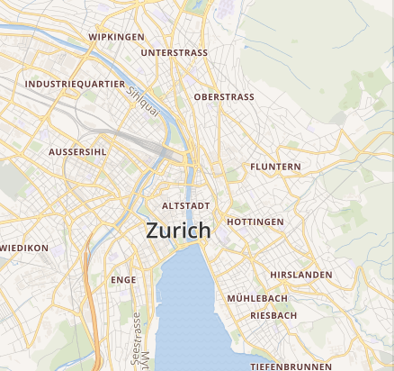
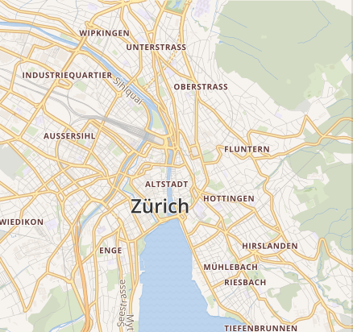
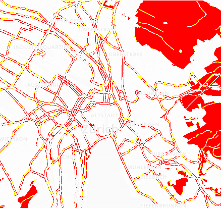
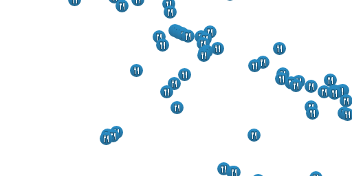
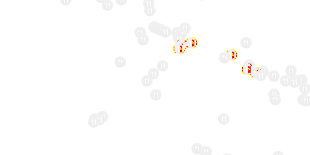

# pixelmatch-py

Python port of https://github.com/mapbox/pixelmatch.

A fast pixel-level image comparison library, originally created to compare screenshots in tests.

Features accurate **anti-aliased pixels detection**
and **perceptual color difference metrics**.

```python
from pixelmatch import pixelmatch

num_diff_pixels = pixelmatch(img1, img2, 800, 600, diff, {
  'threshold': 0.1
})
```

Implements ideas from the following papers:

- [Measuring perceived color difference using YIQ NTSC transmission color space in mobile applications](http://www.progmat.uaem.mx:8080/artVol2Num2/Articulo3Vol2Num2.pdf) (2010, Yuriy Kotsarenko, Fernando Ramos)
- [Anti-aliased pixel and intensity slope detector](https://www.researchgate.net/publication/234126755_Anti-aliased_Pixel_and_Intensity_Slope_Detector) (2009, Vytautas Vyšniauskas)

## Install

```bash
pip install pixelmatch
```

## Example output

| expected             | actual               | diff                         |
| -------------------- | -------------------- | ---------------------------- |
|  |  |  |
|  |  |  |
|  |  |  |

## API

### pixelmatch(img1, img2, width, height[output, options])

- `img1`, `img2` — RGBA Image data of the images to compare. **Note:** image dimensions must be equal.
- `width`, `height` — Width and height of the images.
- `output` — Image data to write the diff to, or `None` if don't need a diff image. Note that _all three images_ need to have the same dimensions.
  `options` is a dict with the following properties:

- `threshold` — Matching threshold, ranges from `0` to `1`. Smaller values make the comparison more sensitive. `0.1` by default.
- `includeAA` — If `true`, disables detecting and ignoring anti-aliased pixels. `false` by default.
- `alpha` — Blending factor of unchanged pixels in the diff output. Ranges from `0` for pure white to `1` for original brightness. `0.1` by default.
- `aa_color` — The color of anti-aliased pixels in the diff output in `[R, G, B]` format. `[255, 255, 0]` by default.
- `diff_color` — The color of differing pixels in the diff output in `[R, G, B]` format. `[255, 0, 0]` by default.
- `diff_mask` — Draw the diff over a transparent background (a mask), rather than over the original image. Will not draw anti-aliased pixels (if detected).

Compares two images, writes the output diff and returns the number of mismatched pixels.

## Example usage

### PIL

```python
from PIL import Image

from pixelmatch import pixelmatch


def pil_to_flatten_data(img):
    """
    Convert data from [(R1, G1, B1, A1), (R2, G2, B2, A2)] to [R1, G1, B1, A1, R2, G2, B2, A2]
    """
    return [x for p in img.convert("RGBA").getdata() for x in p]

img_a = Image.open("a.png")
img_b = Image.open("b.png")
width, height = img_a.size

data_a = pil_to_flatten_data(img_a)
data_b = pil_to_flatten_data(img_a)
data_diff = [0] * len(data_a)

mismatch = pixelmatch(data_a, data_b, width, height, data_diff, {
    "includeAA": True
})

img_diff = Image.new("RGBA", img_a.size)

def flatten_data_to_pil(data):
    return list(zip(data[::4], data[1::4], data[2::4], data[3::4]))

img_diff.putdata(flatten_data_to_pil(data_diff))
img_diff.save("diff.png")
```
